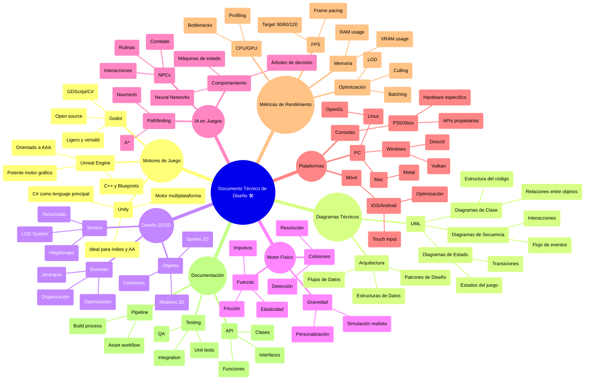

```mermaid
mindmap
 root((Documento Técnico de Diseño 🛠️))
   ((Motores de Juego))
       ("Unity")
           ("Motor multiplataforma")
           ("Ideal para indies y AA")
           ("C# como lenguaje principal")
       ("Unreal Engine")
           ("Potente motor gráfico")
           ("Orientado a AAA")
           ("C++ y Blueprints")
       ("Godot")
           ("Open source")
           ("Ligero y versátil")
           ("GDScript/C#")

   ((Diagramas Técnicos))
       ("UML")
           ("Diagramas de Clase")
               ("Estructura del código")
               ("Relaciones entre objetos")
           ("Diagramas de Secuencia")
               ("Flujo de eventos")
               ("Interacciones")
           ("Diagramas de Estado")
               ("Estados del juego")
               ("Transiciones")
       ("Arquitectura")
           ("Patrones de Diseño")
           ("Estructuras de Datos")
           ("Flujos de Datos")

   ((Diseño 2D/3D))
       ("Terreno")
           ("Heightmaps")
           ("Texturizado")
           ("LOD System")
       ("Objetos")
           ("Modelos 3D")
           ("Sprites 2D")
           ("Colisiones")
       ("Escenas")
           ("Organización")
           ("Jerarquía")
           ("Optimización")

   ((Motor Físico))
       ("Gravedad")
           ("Simulación realista")
           ("Personalización")
       ("Colisiones")
           ("Detección")
           ("Resolución")
       ("Fuerzas")
           ("Impulsos")
           ("Fricción")
           ("Elasticidad")

   ((IA en Juegos))
       ("Pathfinding")
           ("A*")
           ("Navmesh")
       ("Comportamiento")
           ("Árboles de decisión")
           ("Máquinas de estado")
           ("Neural Networks")
       ("NPCs")
           ("Rutinas")
           ("Interacciones")
           ("Combate")

   ((Plataformas))
       ("PC")
           ("Windows")
               ("DirectX")
               ("Vulkan")
           ("Mac")
               ("Metal")
           ("Linux")
               ("OpenGL")
       ("Consolas")
           ("PS5/Xbox")
               ("Hardware específico")
               ("APIs propietarias")
       ("Móvil")
           ("iOS/Android")
               ("Optimización")
               ("Touch input")

   ((Métricas de Rendimiento))
       ("FPS")
           ("Target 30/60/120")
           ("Frame pacing")
       ("Memoria")
           ("RAM usage")
           ("VRAM usage")
       ("CPU/GPU")
           ("Profiling")
           ("Bottlenecks")
       ("Optimización")
           ("LOD")
           ("Culling")
           ("Batching")

   ((Documentación))
       ("API")
           ("Funciones")
           ("Clases")
           ("Interfaces")
       ("Pipeline")
           ("Asset workflow")
           ("Build process")
       ("Testing")
           ("Unit tests")
           ("Integration")
           ("QA")
```